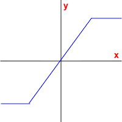

## WAVESHAPE

Waveshape distortion synthesis.

*in RTcmix/insts/std*  
  

-----

##### quick syntax:

**WAVESHAPE**(outsk, dur, PITCH, INDEXMIN, INDEXMAX, AMP, PAN,
WAVETABLE, TRANSFERFUNCTION, INDEXENV\[, ampnormalize\])

CAPITALIZED parameters are [pfield-enabled](pfield-enabled.html) for
table or dynamic control (see the
[maketable](../scorefile/maketable.html) or
[makeconnection](../scorefile/makeconnection.html) scorefile
commands). Parameters after the \[bracket\] are optional and default to
0 unless otherwise noted.


Param Field	| Parameter | Units | Dynamic | Optional | Notes
----------- | --------- | ----- | -------- | --------- | ---------
p0 | start time | seconds | no | no | 
p1 | duration | seconds | no | no | 
p2 | pitch | Hz or oct.pc * | yes | no | see note below | 
p3 | minimum distortion index | 0.0-1.0 | yes | no | 
p4 | maximum distortion index | 0.0-1.0 | yes | no | 
p5 | amp | absolute, for 16-bit soundfiles: 0-32768 | yes | no | 
p6 | pan | 0-1 stereo; 0.5 is middle | yes | no | 
p7 | reference to oscillator waveform table |  -  | yes | no | 
p8 | reference to waveshaping transfer function table |  -  | yes | no | 
p9 | index control envelope |  -  | yes | no | 
p10 | amp normalization |  -  | no | yes | default: on (1) | 

   p2 (freq), p3 (min index), p4 (max index), p5 (amp), p6 (pan) and
   p9 (index) can receive dynamic updates from a table or real-time
   control source.

   p7 (waveform) and p8 (transfer function) should be references to pfield table-handles.

   Author: Brad Garton; rev for v4, JGG, 7/22/04

  

-----

  
**WAVESHAPE** produces sound using *waveshaping*, a type of distortion
synthesis where an input waveform is modified by a *transfer function*
to produce an output signal. <span id="usage_notes"></span>

### Usage Notes

The technical description of waveshaping is that an input signal, *x*,
puts out an output signal, *y*, by passing through a function defined as
`y = f(x)`. So, for example, `f(x) = x2` will exponentially expand the
amplitude of the incoming waveform (Dodge and Jerse, 1985).

What does this mean? Imagine a transfer function as a line drawn on a
cartesian coordinate system:

  


  
The x-axis is where the input values from the signal are located. These
are then mapped onto te y-axis -- the output values -- by mapping from
the x-axis to the transfer function curve and then over to the y-axis:

  


  
Note that if the input value goes above or below a certain point on the
above graph, the output value will remain constant even if the input
value increases beyond that point (positive or negative). This simple
waveshaping distortion will result in "clipping" the input signal:

  


  

The "INDEXMIN" (p3) and "INDEXMAX" (p4) set the parameters for how the
lookup/transfer function works. In the above example, the "INDEXMIN" was
assumed to be 0.0 and the "INDEXMAX" was 1.0. This will use the full
range of the x-axis input values, i.e. the whole transfer function. You
may choose to use just a small portion of the transfer function for
doing the x-axis -\> y-axis mapping by setting these two values between
0.0 and 1.0.

The particular range of lookup values will also be determined by the
"INDEXENV" pfield control envelope (p9). It determines how much of the
range between p3 and p4 is used. Changing this dynamically can alter the
spectrum of the note through time. For example, a control envelope that
traveled from 0.0 to 1.0 back to 0.0 for the duration of a note with a
transfer function like the one pictured above will gradually introduce
distortion into the output wave and then gradually reduce it. All
timbres produced by **WAVESHAPE** are harmonic spectra, however. No
non-harmonic partials can be generated by waveshaping.

p8 (the "TRANSFERFUNCTION") is a pfield reference to a table containing
the transfer function to be used. These are generally constructed using
the [maketable](../scorefile/maketable.html) scorefile command. Of
special interest is the [maketable("cheby",
...)](../scorefile/maketable.html#cheby) option. Chebyshev polynomials
can help design transfer functions with particular harmonic
characteristics.

The transfer-function process (called a "table lookup" by the way) also
imparts an amplitude to the signal as the "INDEXENV" travels between 0.0
and 1.0. Because this is primarily used for determining the spectral
character of the note, you may wish to use an independent amplitude
envelope (done using the pfield-control capabilities of the "AMP"
parameter, p5). To guarantee that a full output results from the
waveshaping, the optional "ampnormalize" parameter (p10) can be set to 1
(this is the default, by the way). To turn off this normalization, set
it to 0. Why would you want to turn this off? The amp normalization in
this instrument can cause clicks at the beginning and ending of notes if
you don't set your amplitude envelope.

Any waveform may be used as an input function. The waveform table is
specified in p7 ("WAVETABLE").

Be aware that oct.pc format generally will not work as you expect for p3
(pitch) if the pfield changes dynamically because of the 'mod 12' aspect
of the pitch-class (.pc) specification. Use direct frequency (hz) or
linear octaves instead.

**WAVESHAPE** can produce mono or stereo output.

### Sample Scores

very basic:

```cpp
   rtsetparams(44100, 2)
   load("WAVESHAPE")

   ampenv = maketable("line", 1000, 0,0, 3.5,1, 7,0)
   waveform = maketable("wave", 1000, "sine")
   transferfunc = maketable("linebrk", 1000, -0.5, 300, -0.5, 200, 0, 200, 0.5, 300, 0.5)
   indexfunc = maketable("line", 1000, 0,0, 3.5,1, 7,0)

   WAVESHAPE(0, 7, 7.02, 0, 1, 20000*ampenv, 0.3, waveform, transferfunc, indexfunc)
   WAVESHAPE(0, 7, 7.021, 0, 1, 20000*ampenv, 0.7, waveform, transferfunc, indexfunc)
```
  
  
slightly more advanced:

```cpp
   rtsetparams(44100, 2)
   load("WAVESHAPE")

   ampenv = maketable("line", 1000, 0,0, 3.5,1, 7,0)
   waveform = maketable("wave", 1000, "sine")
   transferfunc = maketable("cheby", 1000, 0.9, 0.3, -0.2, 0.6, -0.7)
   indexfunc = maketable("line", 1000, 0,0, 3.5,1, 7,0)

   WAVESHAPE(0, 7, 7.02, 0, 1, 20000*ampenv, 0.99, waveform, transferfunc, indexfunc)

   ampenv = maketable("line", 1000, 0,0, 1.5,1, 7,0)
   indexfunc = maketable("line", 1000, 0,1, 7,0)

   WAVESHAPE(4, 7, 6.091, 0, 1, 20000*ampenv, 0.01, waveform, transferfunc, indexfunc)
```

  

-----

### See Also

[maketable](../scorefile/maketable.html),
[pchcps](../scorefile/pchcps.html), [MULTIWAVE](MULTIWAVE.html),
[VWAVE](VWAVE.html), [HALFWAVE](HALFWAVE.html), [SYNC](SYNC.html),
[WAVETABLE](WAVETABLE.html), [FMINST](FMINST.html),
[AMINST](AMINST.html), [WAVY](WAVY.html), [WIGGLE](WIGGLE.html)
