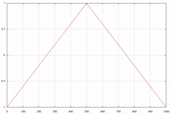
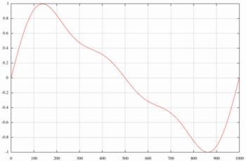

# Basic RTcmix Tutorial

Because of its [Ancient History](../about/index.html), RTcmix was
developed initially as a *command-line* program. What does this mean for
you? To use RTcmix as a standalone music creation application, you will
need to edit a text file (called a **scorefile**) filled with command
directives for RTcmix. You will then need to send this scorefile into
RTcmix where it can be properly parsed and executed. If you are using
RTcmix as part of another application (such as the Max/MSP
[rtcmix\~](../rtcmix_/index.html) object) with internal buffers for
RTcmix scripts, you don't even have to do this scorefile business --
just do what the application documents say to do an RTcmix will work *as
if by magic\!*.

Fortunately, using scorefiles is also a very simple thing to do on most
Unix-like systems. Suppose that you create a scorefile called
"greatmusic.score". To run RTcmix with the commands you have
painstakingly entered and saved in the "greatmusic.score" file, all you
need to do is to say (from a Terminal or Shell window):

```cpp
CMIX < greatmusic.sco
```

Of course, this makes several basic assumptions -- we are assuming that
you are "in" the same directory where the file "greatmusic.score" is
stored, and we are also assuming that the RTcmix *CMIX* command has been
installed and that your command path has been set properly (please see
the [Command Line RTcmix](../rtcmix/index.html) page for directions on
how to do this, or consult a good Unix tutorial for information about
directories, command search paths, etc.). Be sure that the
"greatmusic.sco" file is a text-only file, any extraneous formatting
commands used by Word (for .doc files) or other document editors will be
thoroughly confusing to RTcmix.

Once the *CMIX* application parses and executes the commands in your
"greatmusic.score" scorefile, you should hear the ASTOUNDING SOUNDS that
you have specified by the particular directives you have entered into
the scorefile.  

## Structure of the Scorefile -- a Simple *RTcmix* Example

Let's take a look at a very basic RTcmix scorefile. Suppose that the
incredibly Great Music you wanted to create using your
"greatmusic.score" file consisted of a single, 3.5-second long tone at
440 Hz. An RTcmix scorefile that would specify this might contain the
following text:

```cpp
rtsetparams(44100, 2)
load("WAVETABLE")

waveform = maketable("wave", 1000, "tri")

WAVETABLE(0, 3.5, 20000, 440.0, 0.5, waveform)
```

Easy as pie, eh? We'll take a closer look at each line in the above.
First of all, there is

```cpp
rtsetparams(44100, 2)
```

You will need an [rtsetparams](../reference/scorefile/rtsetparams.html)
command in every RTcmix scorefile you intend to run. It sets up the
audio hardware properly for sound creation. In this case we are using it
with 2 parameters specified: a sampling rate of 44100 and stereo (2
channels) output. *\[note: the sampling rate and number of channels
specification will be limited by the audio hardware one your computer. A
sampling rate of 44100 and 2-channel output should work for nearly all
contemporary computers.\]*

Notice that every RTcmix scorefile command looks like a function in many
standard computer-programming langauges. The syntax consists of a
command name followed by a set of parameters (in parentheses) for the
command. In RTcmix scorefiles, the parameters can be specified as
integers (no decimal point) or as floating-point numbers (yes, with a
decimal point) -- it doesn't make a difference. What's even more fun,
you can also substitute variables, additional functions, or expressions
for any parameter in an RTcmix scorefile command. Some RTcmix scorefile
commands require literal or string arguments, specified in
"quotation\_marks". We cover these features in more detail below.

The next line

```cpp
load("WAVETABLE")
```

tells RTcmix that we will be using the
[WAVETABLE](../reference/instruments/WAVETABLE.html) digital synthesis
instrument. RTcmix has a fairly rich set of pre-made
[instruments](../reference/instruments/index.html) for use in
scorefiles, and you can easily create your own instrument designs. Once
you load an instrument using the
[load](../reference/scorefile/load.html) command, it is available for
use throughout the score; you don't have to reload it again.

Each RTcmix instrument has a unique set of parameters required to
specify a sound. Many instruments also draw upon additional data, such
as waveforms for synthesis, envelopes for control of amplitude and other
parameters, etc. These are represented in RTcmix by special variables
called *pfield-handles* or *table-handles* (both of these terms are used
somewhat somewhat interchangeably). The command in our scorefile:

```cpp
waveform = maketable("wave", 1000, "tri")
```

creates one of these 'table-handles'. The
[maketable](../reference/scorefile/maketable.html) command is used to
initialize these variables and build the appropriate additional data. In
this case, *maketable* is being asked to build a waveform (*"wave"*)
using 1000 data points (this is a fairly standard number for no really
good reason, except that it pretty much works). The waveform it will
build is one cycle of a triangular wave (*"tri"*). After interpreting
this command, the *waveform* variable will reference an internal array
containing this data (plotted using the RTcmix
[plottable](../reference/scorefile/plottable.html) command):  
  



  
  
We could use *maketable* to create other waveforms for the WAVETABLE
instrument to use. For example, the following assignment to the
*waveform* variable:

```cpp
waveform = maketable("wave", 1000, 1.0, 0.4, 0.2)
```

takes advantage of the *"wave"* specifier's ability to design a wave
given the relative strengths of different hamronics in the waveform. The
parameters determine the relative strength of harmonics in a waveform.
In the above case, harmonic \#1 (the fundamental) will have an amplitude
of 1.0; harmonic \#2 will have an amplitude of 0.4, and harmonic \#3
will be in the composite waveform with an amplitude of 0.2. The
resulting waveform looks like this:  
  



  
  
Finally, we get to the WAVETABLE command itself. After setting up the
two function-tables, the parameters for WAVETABLE are very simple.

```cpp
WAVETABLE(0, 3.5, 20000, 440.0, 0.5, waveform)
```

Consulting the [WAVETABLE](../reference/instruments/WAVETABLE.html)
documentation, the first parameter is the starting time. *\[note: all
times in RTcmix are in seconds unless otherwise stated in the
documentation.\]* The second is the duration, with the third being the
amplitude and the fourth the frequency. The fifth parameter is the
"stereo spread" or "stereo location". This is a value between 0.0 and
1.0 determining how much of the synthesized signal will be placed in the
channel 0 (usually the left channel) or channel 1 (usually right). A
value of 0.5 will split the signal equally between the two channels, a
value of 0.2 will place more of the signal in the left, etc. This
parameter is described as an optional parameter. We could have left it
out of our WAVETABLE command:

```cpp
WAVETABLE(0, 3.5, 20000, 440.0)
```

but this would have two consequences for our "greatmusic.sco" sound. The
first is that it would default to a value of 0, which means all of the
sound in our 2-channel output would come only through channel 0. The
second is that we need to specify parameter 5 in order to use the
*waveform* table-handle variable in parameter 6 to reference the
waveform we want WAVETABLE to use. The reason this final parameter is
also optional is to allow WAVETABLE to employ an older method for
specifying waveforms using the
[makegen](../reference/scorefile/makegen.html) command instead of
*maketable*. Again, see the [earlier documentation](standalone3.x.html)
for a discussion of how this approach works. Many RTcmix instruments
have optional parameters like this, sometimes required when other
p-fields have certain values, often optional for use at your discretion.

Now, saving all this in the "greatmusic.score" scorefile, we have
specified precisely what we want -- a note that starts at the beginning
of the CMIX command execution, running for 3.5 seconds, with an
amplitude of 20000 and a frequency of 440.0 Hz. Typing the command

```cpp
CMIX < greatmusic.sco
```

will give you exactly that, using as a timbre the waveform we specified
in the

```cpp
waveform = maketable("wave", 1000, "tri")
```

scorefile command.  
  

-----

  
Some final comments about this simple scorefile -- you may be wondering
where the heck we came up with an amplitude specification of 20000.
RTcmix generally treats amplitude in two ways. The method used by
instruments doing direct synthesis of sound (like WAVETABLE) is to work
on a 16-bit (CD-quality, integer) scale. This means that the absolute
amplitude allowed by all combined RTcmix notes is 32768. Any
sample-value higher than this will generate distortion, probably
something you don't want to hear in your ASTOUNDING SOUNDS. Much lower
than 5000 or 10000 will probably be difficult to hear, so we chose 20000
is a good starting-point for our scorefile.

For instruments that signal-process an input sound, the amplitude
parameter usually works as a multiplier of the input sound before
signal-processing is done. For example, an amplitude specification of
1.0 will pass the sound into the signal-processing instrument without
altering the amplitude, a multiplier of 0.5 will cut the amplitude of
the input in half, 2.0 will double the amplitude, etc. *\[note: an
example of a signal-processing instrument follows later in this
tutorial.\]*

Often it is a matter of trial and error to find the right amplitude for
the best qualty sound. If you prefer, you can direct RTcmix to write a
floating-point soundfile, which you will need to convert (and 'rescale')
later to a 16-bit format for auditioning. This allows you to use an
amplitude scale of your choice, and you will probably not need to be
concerned about distortion from exceeding an upper-limit (the upper
numerical limit for floating-point numbers is quite large on current
machines). You will need to consult the documentation for the
[rtoutput](../reference/scorefile/rtoutput.html) scorefile command to do
this.

Reading the [WAVETABLE](../reference/instruments/WAVETABLE.html)
documentation, you may notice that it mentions that the frequency or
pitch of the note may be specified in Hz (cycles per second) or in
something called *oct.pc* notation. *oct.pc* is a way to use standard
"western" keyboard notes without having to look up the pitch-frequency
conversion. It works by arbitrarily assigning the octave of middle-C to
8.00. Any semitone above middle-C is added as a "hundredth" to the left
of the decimal point, i.e. 8.01 is the C\# just above middle-C, 8.02 is
the D, 8.03 is the D\# (Eb), etc. up to 8.12, which is equivalent to
9.00. 9.01 is then the C\# one octave and a semitone abouve midddle-C.

The fun thing about this notation is that you are not limited to
keyboard-notes. A pitch specification of 7.07542389 will select a
frequency that is somewhere about half-way between the G (7.07) and Ab
(7.08) just below middle-C. Different RTcmix instruments will require
the pitch or frequency to be specified in different ways, although the
scorefile commands [cpspch](../reference/scorefile/cpspch.html),
[pchcps](../reference/scorefile/pchcps.html) or other related commands
can do most necessary conversions. The WAVETABLE instrument allows for
both Hz and oct.pc by arbitrarily choosing that a value of "15.00" is
probably at the lowest end for a Hz-specification and at the highest end
for an oct.pc specification. WAVETABLE listings of

```cpp
WAVETABLE(0, 3.5, 20000, 8.09, 0.5, waveform)
```

and

```cpp
WAVETABLE(0, 3.5, 20000, 440.0, 0.5, waveform)
```

will produce identical results.

Also in the WAVETABLE documentation, you will note that the parameters
are referred to as "p-fields", and that the numbering of parameters
starts at 0. So the start-time parameter for WAVETABLE is given as "p0",
and the duration as "p1", amplitude as "p2"... RTcmix instruments are
not limited in how they use (or how many they use) p-fields, although
for synthesis instruments p0 is usually the start time, and p1 is the
duration. For signal-processing instruments, p0 is the output start
time, p1 is usually the input start time, and p2 is the duration.  

## A Simple *RTcmix* Signal-Processing Example

This set of RTcmix scorefile commands will amplitude-modulate an input
soundfile using the [AM](../reference/instruments/AM.html) instrument:

```cpp
rtsetparams(44100, 2)
load("AM")

rtinput("/snd/somesoundfile.aiff")
rtoutput("/snd/amsound.aiff")

ampenv = maketable("line", 1000, 0,0, 1,1, 9,1, 10,0)
amwave = maketable("wave", 1000, "sine")

AM(0, 0.5, 4.34, ampenv, 478.98, 0, 0.2, amwave)
AM(5.43, 0.5, 4.34, ampenv, 487.98, 1., 0.8, amwave)

amwave = maketable("wave", 1000, 1, 0.4, 0.7, 1.4, 0, 0, 0.33334)
AM(2, 0, 21, 0.2*ampenv, 6.05, 0, 0.5, amwave)
```

Most of this scorefile is similar to the simple WAVETABLE scorefile
above, with a few obvious and more subtle differences. The
[rtinput](../reference/scorefile/rtinput.html) and
[rtoutput](../reference/scorefile/rtoutput.html) commands are new, and
relatively simple to understand. Although in the example above we are
processing an existing soundfile, the documentation page for *rtinput*
describes how to set up for real-time audio input to enable live signal
processing. *\[note: this will cause the "input skip" parameter to be
ignored in RTcmix instruments.\]* In our example, we are going to
process the soundfile "/snd/somesoundfile.aiff".

The presence of the *rtoutput* command will instruct RTcmix to write a
soundfile (in this case an aiff file -- RTcmix will use the suffix of
the filename by default to determine the type of soundfile. This can be
changed and the data format set "by hand" with optional parameters for
*rtoutput*). At the end of the *CMIX* execution of the scorefile, the
soundfile "/snd/amsound.aiff" will exist with the processed sound in it.
RTcmix will play the output sound as it is created, unless the
[set\_option](../reference/scorefile/set_option.html) command is used to
turn the RTcmix audio output off. *rtoutput* will also check to see if
the file already exists -- if it does it will terminate the application
and not overwrite the file. This behavior can also be changed using the
[set\_option](../reference/scorefile/set_option.html) command.

The use of the amplitude envelope specified by

```cpp
ampenv = maketable("line", 1000, 0,0, 1,1, 9,1, 10,0)
```

by the AM commands needs a little explanation. The duration for the AM
notes are 4.34, 4.34 and 21 seconds respectively. But the use of the
*"line"* specifier for the
[maketable](../reference/scorefile/maketable.html#line) command, which
'draws' an envelope using \[time, value\] parameters (reading from the
above command parameters: *at time 0 be at value 0; at time 1 be at
value 1; at time 9 be at value 1; at time 10 be at value 0*), suggests
that the duration of the note should be 10 seconds long. RTcmix will
'stretch' or 'compress' the data for an amplitude envelope (as well as
many other note-length envelopes) to fit the duration of each individual
note. Basically, we have specified an amplitude envelope with a 10%
fade-up and a 10% fade-down, no matter what the duration. If you want to
have very precise amplitude points on your amplitude envelope, then just
be sure that the duration of the note you are generating matches the
duration of the \[time, value\] pairs on your amplitude *maketable*
command.

Note also the final use of the *ampenv* envelope:

```cpp
AM(2, 0, 21, 0.2*ampenv, 6.05, 0, 0.5, amwave)
```

*table-handles* and *pfield-handles* can generally be treated
arithmetically like most variables in the scorefile. The *maketable*
command by default creates waveforms between the values \[-1.0, 1.0\] or
control envelopes between \[0.0, 1.0\] if negative values are not
present. The third p-field for the
[AM](../reference/instruments/AM.html) instrument is an amplitude
multiplier for the input sound. Suppose that we didn't want to process
this sound at full amplitude (i.e. multiply it by 1.0), but instead
wanted to lower the amplitude to 20% of the input level. The item

```cpp
AM(..., 0.2*ampenv, ...)
```

will do this -- all of the values of the *maketable* envelope
represented by the *ampenv* variable will be multiplied by 0.2. So
instead of going from 0.0 to 1.0, the control envelope will fade up to
0.2 and then back down to 0.0. Doing this envelope multiplication is
very common for synthesis instruments where amplitudes usually need to
be specified on a 0-32768 scale. There are also other ways to determine
the amplitude in a *maketable* control signal (check the optional
*"nonorm"* specifier for the command).

The waveform used by the AM instrument is referred to by the
table-handle variable *amwave* -- a sine wave initially:

```cpp
amwave = maketable("wave", 1000, "sine")
```

This variable is then reassigned to a more harmonically-complex waveform
towards the end of the scorefile:

```cpp
amwave = maketable("wave", 1000, 1, 0.4, 0.7, 1.4, 0, 0, 0.33334)
```

This is perfectly fine. You may reassign variables at any time in an
RTcmix scorefile. What is unusual is the time-ordering of the AM note
commands. The third AM note actually occurs second in time. RTcmix
instrument commands do not have to be time-sorted in a scorefile. But
the value or assignment that a variable has *at the time it is
encountered (parsed) in the scorefile* is the value that will be used in
a note command, regardless of when the note will actually occur in time.
In our AM scorefile, the first two AM commands listed:

```cpp
AM(0, 0.5, 4.34, 0.7, 478.98, 0, 0.2, amwave)
AM(5.43, 0.5, 4.34, 0.7, 487.98, 1. 0.8, amwave)
```

will use the simple sine wave as a modulation waveform, but the third
command:

```cpp
AM(2, 0, 21, 0.2*ampenv, 6.05, 0, 0.5, amwave)
```

which will be the second sonic event entrance, will draw upon the
harmonically-complex modulation waveform.

There are other subtleties in using the *pfield-handle* and
*table-handle* variables (such as *ampenv* and *amwave* above). Please
see the [Short Tour of PField Capabilities](pfields.html) document for
more detailed information.  
  

-----

  
***A note about the output listing***

Going back to our the first simple WAVETABLE scorefile above
("greatmusic.sco"), running the

```cpp
CMIX < greatmusic.sco
```

command will result in something like the following output on the
Terminal or Shell window:

```cpp
--------> RTcmix 4.0.0 (CMIX) <--------
============================
rtsetparams:  44100 2 
Audio set:  44100 sampling rate, 2 channels
============================
load:  "WAVETABLE" 
Loaded RT functions from shared library:
       '/usr/local/src/RTcmix/shlib/libWAVETABLE.so'.
============================
maketable:  "wave" 1000 "tri" 
===============
WAVETABLE:  0 3.5 20000 440 0.5 PF:[-1,...,-0.996] 
   
*** WARNING:  No bus_config defined, setting default (in/out).
   
closing ...
   
Peak amplitudes of output:
     channel 0: 10000.000000 (-10.31 dBFS) at frame 8192 (0.18576 seconds)
     channel 1: 10000.000000 (-10.31 dBFS) at frame 8192 (0.18576 seconds)
```

This output should be fairly self-explanatory. The main thing to realize
is that the p-field (parameters) that are printed in the listing are the
actual numeric values that are passed into RTcmix (or starting and
ending values in the case of pfield-handles or table-handles). Any
variables, mathematical operations or functions that are employed in the
scorefile will display their calculated value in this listing. The total
peak amplitude for the output channel(s) is also printed. This listing
is very useful when debugging a score. If you are totally annoyed by
this, you can turn off the output printing (or turn it back on again)
using the [print\_off](../reference/scorefile/print_off.html) or
[print\_on](../reference/scorefile/print_on.html) scorefile commands, or
set the global print option in the
[set\_option](../reference/scorefile/set_option.html) command.  

## A Simple *RTcmix* Algorithmic Scorefile Example

Suppose that you wanted to generate a three-octave chromatic scale,
starting at the C one octave below middle-C. using the WAVETABLE
instrument. The hard way to do this would be to type in all 36 WAVETABLE
note commands "by hand". The easy way would be to use the following
scorefile:

```cpp
rtsetparams(44100, 2)
load("WAVETABLE")
reset(44100)

env = maketable("line", 1000, 0,0, 1,1, 2,1, 3,0)
wave = maketable("wave", 1000, 1.0, 0.3, 0.2, 0.1, 0.15)

start = 0.0
pitch = 7.00
for (i = 0; i < 36; i = i+1)
{
      WAVETABLE(start, 0.5, 10000*env, pitch, 0.5, wave)
      start = start+0.3
      pitch = pitch+0.01
}
```

The basic functioning of this scorefile should be pretty easy to
understand, although a few particulars are new. The
[reset](../reference/scorefile/reset.html) scorefile command sets how
often RTcmix will update control functions (like amplitude envelopes)
within instruments designed to take advantage of this capability. Saying

```cpp
reset(44100)
```

will guarantee smooth amplitude transitions in our notes. Updating will
happen once every sample. The default is to update 1000 times/second,
which is normally fine unless you have very fast control changes
occuring. Our WAVETABLE notes in the score are 0.5 seconds long, and
since we are taking advantage of the 'stretching' and 'compressing'
feature of the amplitude function-table slot, we will have fade-up and
fade-down times in the hundreths of a second -- a 1000 times/second
update may not be enough.

Why not always update at 44100/second? Most of the time this
fine-grained updating is not necessary, and it significantly slows down
the computation of notes. In real-time situations where many notes may
be scheduled simlutaneously, a more efficient, faster-running instrument
may be preferable. Realistically, slower update times (for example,
resetting at 10000 times/second, *reset(10000)* are probably more than
adequate for all but the finest-grained control envelope requirements.

The other obvious feature of this WAVETABLE score is the use of
variables and looping control-flow structures (the *for (i = 0...)*
loop). The default RTcmix installation uses a command-parsing language
called **[Minc](../reference/scorefile/Minc.html)** (**M**inc **i**s
**n**ot **c**). This parsing language, originally written by Lars Graf
and extended and modified by Doug Scott and John Gibson, includes all of
the original "C" language control-flow constructs (*while* loops, *for*
loops, *if-then-else* branches, nesting of these constructs, etc.) as
well as allowing for the use of variables anywhere in an RTcmix command.
The "**i**s **n**ot **c**" designation comes primarily from three
aspects of the parser:

You <u>can</u> declare and type variables if you'd like, but it isn't
needed for the language. Same for semicolons.

*Minc* also allows us to embed scorefile commands within commands, using
them like nested functions. By making use of the
[random](../reference/scorefile/random.html) scorefile command
(*random()* returns a pseudo-random number between 0.0 and 1.0), we can
generate unique timbres (waveforms) for every note in our chromatic
scale scorefile:

```cpp
rtsetparams(44100, 2)
load("WAVETABLE")

env = maketable("line", 1000, 0,0, 1,1, 2,1, 3,0)

start = 0.0
pitch = 7.00
for (i = 0; i < 36; i = i+1)
{
wave = maketable("wave", 1000, random(), random(), random(), random(), random())
 WAVETABLE(start, 0.5, 10000*env, pitch, 0.5, wave)
 start = start+0.3
 pitch = pitch+0.01
}
```

Saving the above information in a scorefile and executing it with the
*CMIX* command should schedule 36 overlapping, 0.5-second-long notes,
each with a different timbre corresponding to the *wave =
maketable(...)* command immediately preceding it in the 'unrolled'
for-loop of the scorefile.  

## A Slightly More Complex Algorithmic Scorefile Example

Our intention is not to teach C-like programming in this tutorial, and
in fact you may want to choose a different command interface such as the
[perl](perl.html) or [python](perl.html) command-language versions of
RTcmix, However, one more algorithmic scorefile example may help
demonstrate a few additional features of the RTcmix command parser as
well as show how small number of scorefile commands embedded in an
algorthmic structure can yield relatively complex output.

Consider the following scorefile:

```cpp
rtsetparams(44100, 2)
load("STRUM")

pitches = { 7.07, 7.09, 7.10, 8.00, 8.02, 8.03, 8.05, 8.07, 8.09 }
plength = len(pitches)

st = 0
for (i = 0; i < 1000; i = i+1)
{
      pchindex = trunc(irand(0, plength))
      pitch = pitches[pchindex]
      START(st, 1.0, pitch, 1.0, 0.1, 10000, 1, random())
      st = st + irand(0.01, 0.3)
}
```

In this scorefile, we are storing pitch values (in oct.pc form) in a
Minc array called *pitches*. We determine how many elements are stored
in the array using the [len](../reference/scorefile/len.html) command,
storing that value in the variable *plength*. We will need this value to
choose elements in the array.

We then spin out 1000 notes using the plucked-string-sounding
[STRUM](../reference/instruments/STRUM.html) instrument. We select the
pitch for each note by randomly choosing one of the elements in the
*pitches* array. We accomplish this with these two lines in the *for*
loop:

```cpp
pchindex = trunc(irand(0, plength))
pitch = pitches[pchindex]
```

The first line uses the RTcmix scorefile command
[irand](../reference/scorefile/irand.html), to set *pchindex* to a
random value between 0 and the number of elements in the *pitches* array
-- this is why we needed the *plength* value The *irand* command returns
a number between its two parameters, but *irand* will generate
fractional values (i.e. 5.78914, or 7.00278). The
[trunc](../reference/scorefile/trunc.html) command will return only the
integer part of these random fractions, which will give us an exact
element in the *pitches* array.

So *pchindex* now contains a random number that will allow us to
retrieve a value from the *pitches* array. The second line does this,
storing this retrieved value in the variable *pitch*.

We are also using the *random* command to choose a stereo location for
each of the 1000 notes we generate, using the optional p-field 7 in the
*START* command.

And finally, we are randomizing the spacing of the notes with the line:

```cpp
st = st + irandom(0.01, 0.3)
```

This will cause each note to follow the preceding note with a delay
varying between 0.01 seconds and 0.31 seconds. *\[note: RTcmix allows
you to specify timing to single-sample accuracy.\]*  

## Additional Scorefile Command Hints

There are a few RTcmix scorefile commands with multiple or optional
parameters that may be useful to you. Some of these we have mentioned
already:

  - The [rtsetparams](../reference/scorefile/rtsetparams.html) command
    has an optional *bufsize* parameter that can affect the real-time
    performance of RTcmix. Usually the default will work fine, though.  

  - The [rtinput](../reference/scorefile/rtinput.html) and
    [rtoutput](../reference/scorefile/rtoutput.html) commands set the
    ability to read from real-time (mic/line) inputs or soundfiles
    (depending on the settings established using the
    [set\_option](../reference/scorefile/set_option.html) command), and
    to set the data type and format of soundfiles.  

  - The [set\_option](../reference/scorefile/set_option.html) command
    also allows you to control a number of other RTcmix features (such
    as turning the audio on or off, checking and reporting amplitude
    peaks, etc.).  

  - The [bus\_config](../reference/scorefile/bus_config.html) command
    can initially appear difficult, but it is quite easy to use. It
    enables a very powerful feature of RTcmix, the ability to send the
    output of one RTcmix instrument directly into the input of another.
    For example, the scorefile:
    
	```
	   rtsetparams(44100, 2)
	   load("WAVETABLE")
	   load("AM")
	    
	   bus_config("WAVETABLE", "aux 0 out")
	   bus_config("AM", "aux 0 in", "out 0-1")
	    
	   amp = maketable("line", 1000, 0,1, 3.5,1)
	   wave = maketable("wave", 1000, 1.0, 0.4, 0.2)
	   WAVETABLE(0, 3.5, 20000*amp, 440.0, 0.0, wave)
	    
	   amamp = maketable("line", 1000, 0,0, 1,1, 9,1, 10,0)
	   amwave = maketable("wave", 1000, "sine")
	   AM(0, 0, 3.5, 0.7*amamp, 478.98, 0, 0.2, amwave)
	
	```

	will generate a 3.5-second long sound via WAVETABLE, and then
	amplitude modulate this sound before playing it or writing a
	soundfile. Given that these *bus\_config* chains can contain fairly
	sophisticated signal-processing instruments, this can be used to
	create complex audio outputs. This feature is especially useful when
	RTcmix us used in an embedded context (RTcmix "inside" another
	application). You can read an early description/tutorial about the
	*bus\_config* command written by John Gibson and Dave Topper by
	clicking [here](bus_config.html).  

  - The new PField commands such as
    [maketable](../reference/scorefile/maketable.html),
    [makeLFO](../reference/scorefile/makeLFO.html),
    [makerandom](../reference/scorefile/makerandom.html),
    [makefilter](../reference/scorefile/makefilter.html) and
    [makeconnection](../reference/scorefile/makeconnection.html)
    represents a powerful control mechanism for RTcmix instruments. The
    [Short Tour of PField Capabilities](pfields.html) discusses a few of
    the capabilities of *pfield-handles* and *table-handles*.  

  - The sample scorefiles in the "RTcmix/docs/sample\_scos" directory
    are also a good source of examples for using RTcmix instruments.
    Many of them are even wonderful little patches of music -- we hope
    you enjoy them all\!
    
  - The documentation for the **Minc** parser [here](../reference/scorefile/Minc.html) is very complete and includes descriptions of a large number of extended and specialized features in the **Minc** language.
 

  
Happy RTcmixing\!  
  
  
Brad Garton  
August, 2003  
*revised July, 2005 for RTcmix 4.0*
